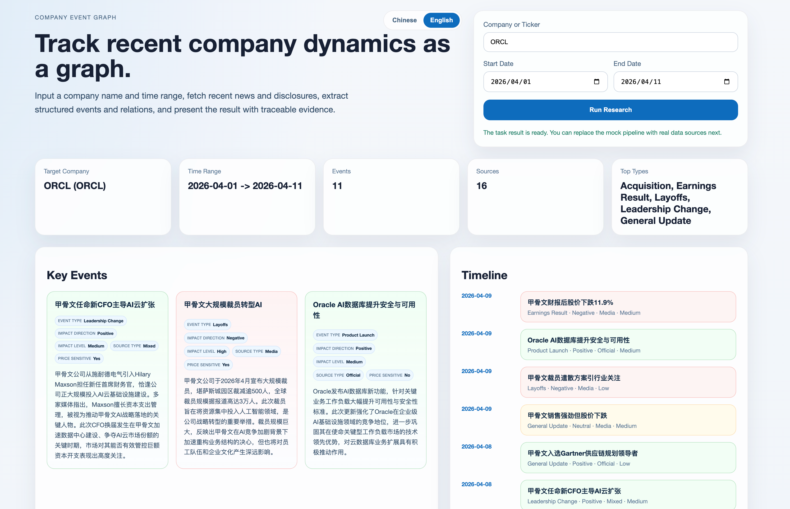
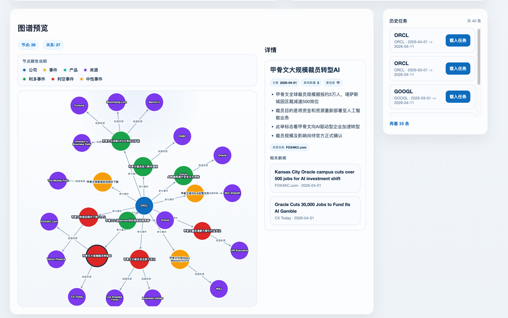

<div align="center">

# 📊 Company News Graph

**用图谱方式追踪公司最近动态**

输入公司名称和时间范围，自动聚合 SEC 官方披露与 Google 新闻报道，
提取结构化投资事件，以可交互图谱呈现——所有结论均可追溯至原始来源。


</div>

---

## ✨ 功能亮点

| 功能 | 说明 |
|------|------|
| 🏛️ **SEC EDGAR 优先** | 自动抓取 8-K、10-K、10-Q 等官方披露，优先于媒体报道 |
| 📰 **Google News 补充** | 智能解析公司真实名称，确保非主流 ticker 也能匹配新闻 |
| 🧠 **可选 AI 事件总结** | 支持 Claude CLI、Anthropic API、OpenAI-compatible 三种方式 |
| 🕸️ **可交互关系图谱** | 基于 Cytoscape.js，节点点击可查看事件详情和来源证据 |
| 📅 **事件时间线** | 按时间顺序展示所有事件，颜色区分利多 / 利空 / 中性 |
| 🏆 **Key Events 面板** | 自动打分筛选最值得关注的重点投资事件 |
| 🔍 **Ticker 自动补全** | 内置 37 只热门股票推荐，支持键盘导航 |
| 💾 **历史任务持久化** | 结果自动落盘，重启后自动恢复，支持随时回查 |

---

## 🖥️ 界面预览




---

## 🏗️ 系统架构

```
用户输入
  │  公司名称 / Ticker + 时间范围
  ▼
后端研究流水线
  ├─ SEC EDGAR  ──→ 官方披露（8-K / 10-K / 10-Q / DEF 14A …）
  │                  ↳ 自动 CIK 查找，支持任意 ticker
  │
  ├─ Google News ──→ 补充媒体报道
  │                  ↳ 用 SEC 真实注册名修正查询词（NVDA → "NVIDIA"）
  │
  ├─ 事件抽取 ────→ 关键词分类（财报 / 并购 / 裁员 / 监管…）
  │
  ├─ 新闻聚类 ────→ 相近标题合并为同一事件簇
  │
  └─ AI 摘要（可选）→ 为每个事件生成标题、摘要、要点、置信度
       ├─ claude-cli          直接复用本机 Claude Code CLI
       ├─ anthropic           调用 /messages 接口
       └─ openai-compatible   调用 /chat/completions 接口

前端展示
  ├─ Key Events 卡片（按重要性打分，取 Top 3）
  ├─ 事件时间线（按时间倒序，颜色标注影响方向）
  ├─ Cytoscape.js 关系图（Company → Event → Source）
  └─ 节点点击详情（来源链接 / AI 摘要 / 原始新闻标题）
```

---

## ⚡ 快速启动

### 后端（FastAPI + Python 3.13）

**首次安装：**

```bash
cd backend
python3 -m venv .venv
source .venv/bin/activate
pip install -e .
uvicorn app.main:app --reload
```

**日常启动：**

```bash
cd backend
source .venv/bin/activate
uvicorn app.main:app --reload
```

> 后端默认监听 `http://127.0.0.1:8000`，启动后可访问 `/health` 确认状态。

### 前端（React + Vite）

**首次安装：**

```bash
cd frontend
npm install
npm run dev
```

**日常启动：**

```bash
cd frontend
npm run dev
```

> 前端默认请求 `http://127.0.0.1:8000`。如需修改，通过环境变量覆盖：
> ```bash
> VITE_API_BASE_URL=http://localhost:9000 npm run dev
> ```

### 一键启动（推荐）

完成首次安装后，直接在项目根目录运行：

```bash
./start_dev.sh
```

脚本会自动检测可用端口、启动前后端，并将前端 API 地址指向实际后端端口，避免端口冲突。

---

## 🤖 AI 事件总结（可选）

默认使用规则生成摘要，**不需要任何 API Key 也能跑通**。如需启用 AI，先创建 `.env`：

```bash
cd backend
cp .env.example .env
```

然后根据你手头的 API 选择下面任意一种方式：

---

### 方式一：复用本机 Claude Code CLI（最省事，零配置）

```env
COMPANY_NEWS_USE_AI=1
LLM_PROVIDER=claude-cli
```

**前提**：本机已安装并登录 [Claude Code CLI](https://claude.ai/download)（即 `claude` 命令可用）。
不需要额外填写任何 Key，后端直接调用 `claude -p` 生成摘要。

---

### 方式二：Anthropic 官方 API

```env
COMPANY_NEWS_USE_AI=1
LLM_PROVIDER=anthropic
ANTHROPIC_API_KEY=sk-ant-xxxxxxxxxxxxxxxx
ANTHROPIC_MODEL=claude-sonnet-4-6
```

**如何获取 Key**：登录 [console.anthropic.com](https://console.anthropic.com) → API Keys → Create Key。

使用中转站时额外加一行：

```env
ANTHROPIC_BASE_URL=https://your-proxy-endpoint
```

---

### 方式三：OpenAI-compatible 协议（中转站 / 其他模型）

```env
COMPANY_NEWS_USE_AI=1
LLM_PROVIDER=openai-compatible
OPENAI_API_KEY=your_api_key
OPENAI_MODEL=claude-sonnet-4-6
OPENAI_BASE_URL=https://your-endpoint/v1
```

兼容任何提供 `/chat/completions` 接口的服务，包括 OpenAI、各类国内中转站、本地部署的 LLM 等。

---

启用后，后端会在聚类完成后为每个事件簇生成：事件标题、中文摘要、关键要点、置信度。
可以从前端摘要卡片的 `AI 状态` 字段，以及后端日志的 `generated_by=` 字样来确认是否生效。

---

## 📁 仓库结构

```
agents/
├── backend/
│   ├── app/
│   │   ├── api/          路由与接口定义
│   │   ├── schemas/      Pydantic 数据模型
│   │   └── services/     核心研究流水线
│   ├── data/tasks/       历史任务持久化（本地 JSON）
│   └── .env.example      环境变量模板
│
├── frontend/
│   └── src/
│       ├── components/   GraphView / InvestmentPanels / SummaryPanel
│       ├── lib/          API 客户端 / i18n / 类型定义
│       └── pages/        App 主页面
│
├── docs/                 产品文档与路线图
└── start_dev.sh          一键启动脚本
```

---

## 🗺️ 近期路线图

- [x] SEC EDGAR 官方披露接入
- [x] Google News RSS 补充新闻
- [x] 可选 AI 事件总结（Claude / OpenAI-compatible）
- [x] Cytoscape.js 可交互图谱
- [x] Key Events 面板 + 事件时间线
- [x] Ticker 自动补全
- [x] 历史任务持久化与回放
- [ ] 更多数据源（Bloomberg、Reuters、earnings call transcript）
- [ ] 完整实体抽取（人名、地名、产品、竞争关系）
- [ ] Neo4j 图数据库接入
- [ ] 多公司对比与竞品追踪

---

## 🌐 开源定位

这个项目聚焦一个具体问题：

> **"研究某家公司在一段时间内发生了什么，并把结果用图谱方式组织起来。"**

它不是通用知识图谱平台，而是更垂直的**公司事件图谱**工具，适合：

- 📈 投研信息快速整理
- 🔭 竞品动态持续追踪
- ⚠️ 风险事件早期预警
- 📖 公司近期历史回顾

欢迎 Issue、PR 和任何使用反馈。
